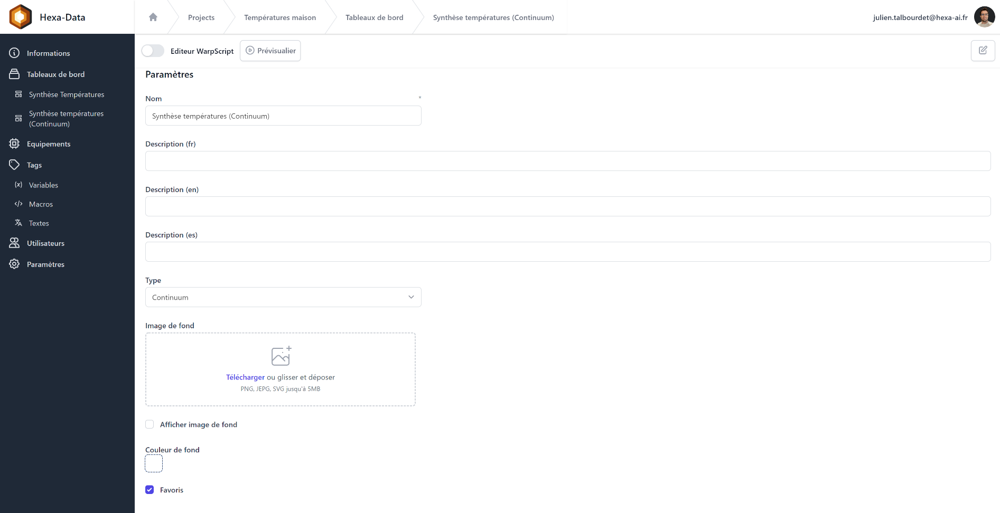
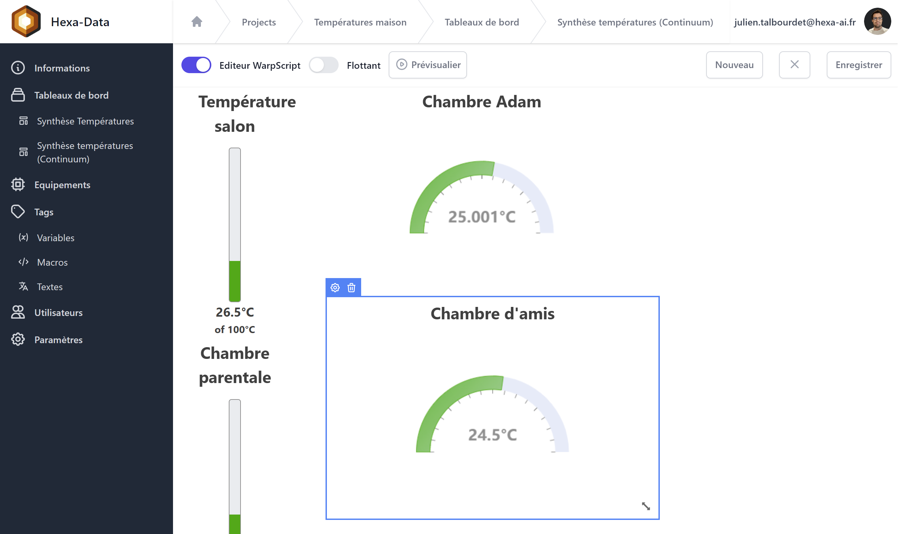
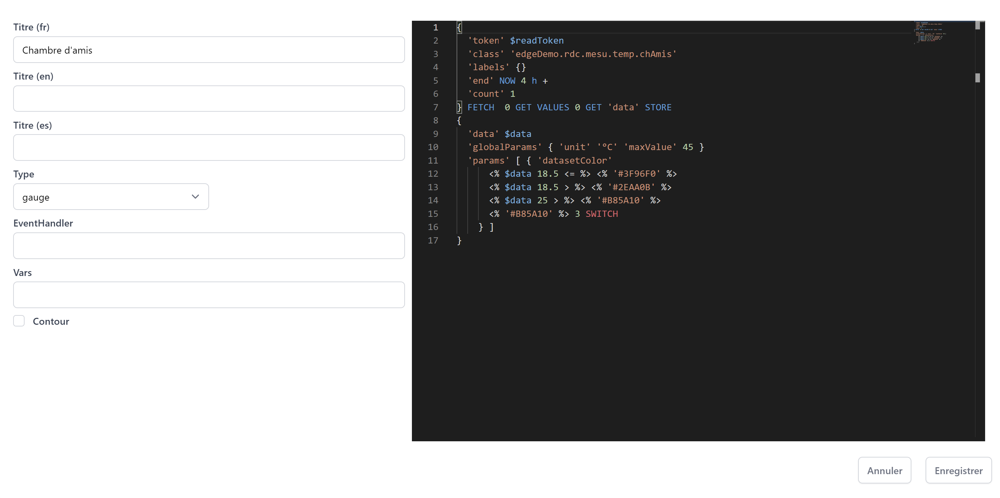

# Continum 

## Introduction

Continum est le tableau de bord en mode "Drag and drop" dans la continuité de Discovery.
Ce mode permet de manipuler simplement les tuiles avec la souris et de créer des tableaux de bord ou synoptiques.

Dans l'édition ou la création, le type du tableau de bord doit être réglé sur ```Continuum```.

Le bouton de type switch (en haut à gauche) permet de passer en mode design et l'édition est rendu possible par le bouton en haut à droite.




En édition, les tuiles peuvent être deplacé, paramètés et supprimés.

Le commutateur ```Flottant``` authorise ou non les tuiles flottantes, en mode non flottant les tuiles sont automatiquement attirées vers le haut. Le mode flottant est destinner à l'animation d'un synoptique en positionnant les tuiles sur un fond de plan.



## Edition de la tuile



### Paramètres

| Champ        | Description                                                                                                                                                                                                                                                                                                                                                            |
|--------------|------------------------------------------------------------------------------------------------------------------------------------------------------------------------------------------------------------------------------------------------------------------------------------------------------------------------------------------------------------------------|
| Titre (fr)   | Titre de la tuile dans la première langue définie dans les paramètres du projet                                                                                                                                                                                                                                                                                        |
| Titre (fr)   | Titre de la tuile dans la seconde langue définie dans les paramètres du projet                                                                                                                                                                                                                                                                                         |
| Titre (fr)   | Titre de la tuile dans la troisième langue définie dans les paramètres du projet                                                                                                                                                                                                                                                                                       |
| Type         | Choix du composant à afficher: line, area, scatter, step-area, spline-area, spline, step, step-after, step-before, annotation, bar, display, image, map, gauge, linear-gauge, circle, pie, plot, doughnut, rose, tabular, svg, input:text, input:list, input:secret, input:autocomplete, input:slider, input:date, input:date-range, button, hidden, calendar, heatmap |
| EventHandler | Définition des évènements à écouter (paramètre ```eventHandler```)                                                                                                                                                                                                                                                                                                     |
| Vars         | Initialisation des variables utilisés dans le tuile en notamment celle en provenance d'évènements                                                                                                                                                                                                                                                                      |
| COntour      | Affiche ou masque le contour de la tuile                                                                                                                                                                                                                                                                                                                               |

