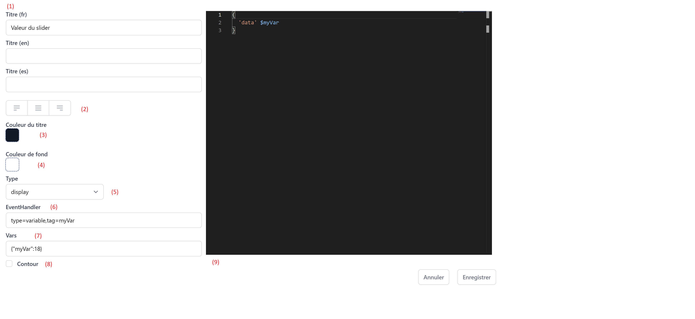

# Edition d'une tuile



1. Titre de la tuile dans les trois langues du projet.
2. Alignement du titre.
3. Couleur du titre.
4. Couleur d'arrière plan (seulement si le contour et affiché).
5. Type de widget utilisé dans la tuile.
6. Choix des évènements écoutés par la tuile.
7. Initialisation des valeurs des variables.
8. Affichage du contour de la tuile. Si le contour n'est pas affiché, l'arrière plan devient transparent.
9. Script de la tuile.


## EventHandler

Le paramètre ````EventHandler``` permet la sélection des évènements à écouter.

**Les attributs:**

* ```type``` correspond aux types d'évènements que la tuile devra écouter (```variable``` ou ```data```).
* ```tag``` filtre les évènements reçus par leur tag.

**Exemples:**

```type=variable,tag=temperature```

Permet de recevoir les évènements de type ```variable``` avec le tag ```temperature```

```type=variable,tag=(temperature|pression)```

Permet de recevoir les évènements de type ```variable``` avec les tags ```temperature``` ou ```pression```

```type=(data|variable),tag=mesure-.*```

Permet de recevoir les évènements de type ```variable``` et ```data``` dont les tags commencent par ```mesure-```

## Vars

Le paramètre ```Vars``` permet d'initialiser la valeur de variables du WarpScript.
La syntaxe doit correspondre à un object clés/valeur au format JSON.

**Exemples:**

```{"consigne": 18}```

Initilise la variable ```$consigne``` à 18.

```{"consigne": 18, "name": "Robert"}```

Initilise la variable ```$consigne``` à 18 ainsi que la variable ```$name``` à ```Robert```


