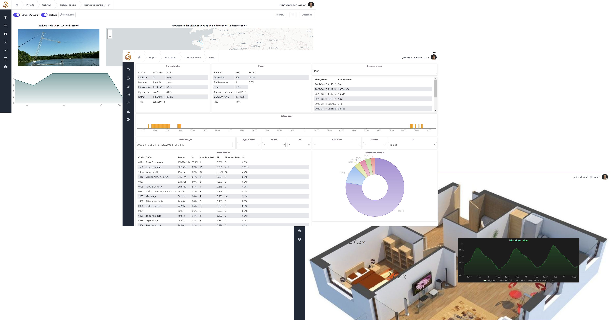
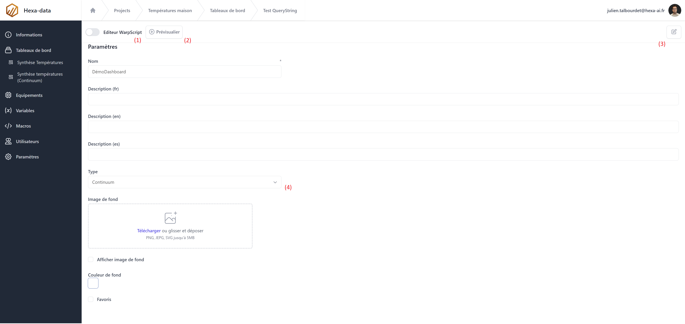
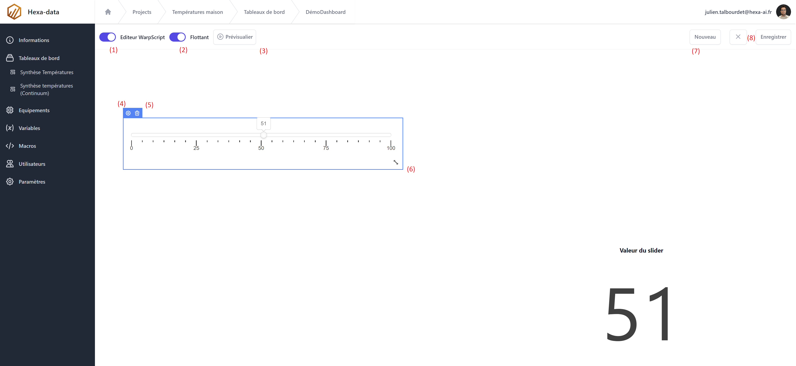

# Les tableaux de bord

Les tableaux de bord d'Hexa-data permettent de visualiser et d'interagir avec les données, les macros et les équipements.



Hexa-data met à disposition deux types de tableaux de bord.

* [Discovery](https://www.warp10.io/content/05_Ecosystem/02_Visualization/02_Discovery/00_Overview) (Tableaux de bord à créer par scripts (WarpScript) et developpé par [SenX](https://senx.io) (l'édituer de Warp10))
* Continuum (Version glisser-déposer de discovery, developpé par nos soins pour en simplifier la mise en oeuvre)

## Discovery

La technologie Discovery permet de construire des tableaux de bord depuis WarpScript et notamment la réalisation de tableaux de bord génériques (en fonction des données).
Pour plus d'informations, nous vous invitons à vous rendre sur la [documentation de Warp10](https://www.warp10.io/content/05_Ecosystem/02_Visualization/02_Discovery/00_Overview) ou nous [contacter](https://hexa-ai.fr/faites-vous-contacter/).


## Continuum

Continum est un mode glisser-déposer permettant de construire et de modifier rapidement vos tableaux de bord.

L'éditeur permet de déposer des tuiles sur la grille

Dans la page des tableaux de bord, créer un nouveau ou cliquer sur le bouton ```Modifier``` d'un existant.



1. Passer du formulaire de création à l'éditeur de tableaux de bord.
2. visualiser le tableau de bord actuel dans un nouvel onglet.
3. Passer en mode édition pour modifier, sauvegarder ou supprimer le tableau de bord.
4. Choix du type de tableau de bord, ```Discovery``` ou ```Continuum```




1. Passer du formulaire de création à l'éditeur de tableaux de bord.
2. Passer en mode flottant pour positionner librement les tuiles
3. visualiser le tableau de bord actuel dans un nouvel onglet.
4. Ouvrir le popup d'édition de la tuile.
5. Supprimer la tuile.
6. Redimenssioner la tuile
7. Insérer une nouvelle tuile.
8. Annuler ou enregistrer les modifications.

