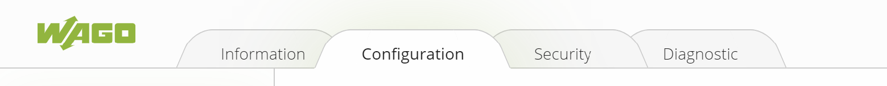
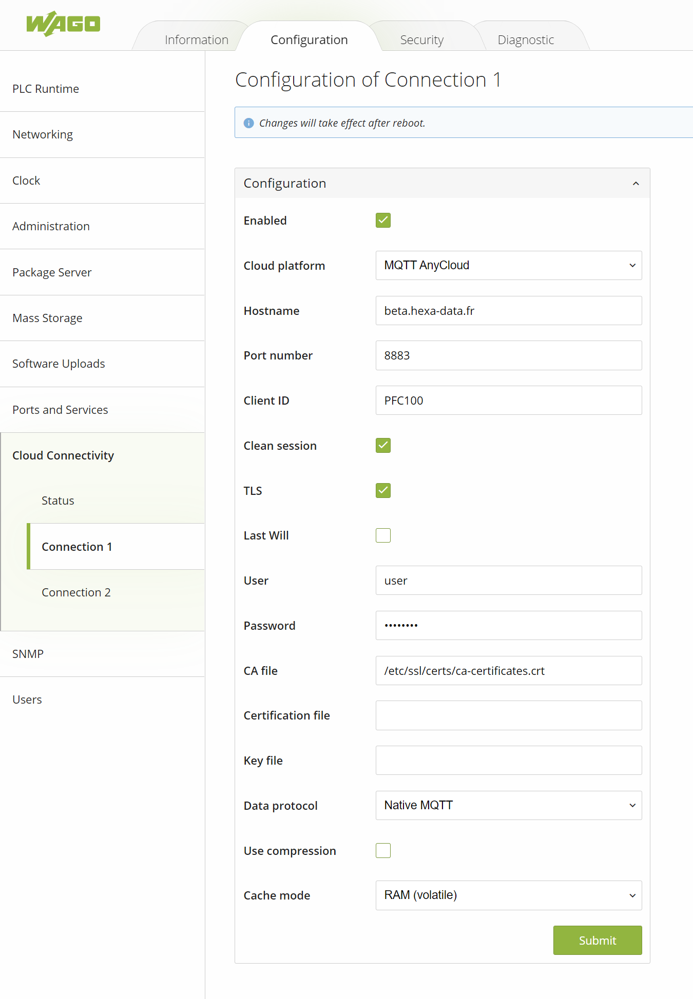

# Connexion d'un automate WAGO (_e!COCKPIT_)

La connexion à Hexa-data depuis un automate WAGO se paramètre dans le WBM (Web Based Management).

Dans l'onglet ``Configuartion``, se rendre dans le menu ``Cloud Connectivity`` puis ``Connection 1``

* Cocher ``Enabled``
* Selectionner ``MQTT AnyCloud`` dans le champ ``Cloud plateform``
* Saisir l'url de l'application dans ``Hostname``

?> Attention à ne pas saisir de ``http://url/`` mais uniquement l'url ou l'IP de votre serveur.

* Saisir le numéro de port ``8883``
* Saisir le ``Client ID`` déclaré dans Hexa-data
* Cocher ``Clen session`` et ``TLS``
* Saisir l'identifiant et le mot de passe déclaré dans Hexa-data dans les champs ``User`` et ``Password``
* Sélectionner ``Native MQTT`` dans le champs ``Data protocol``
* Soumettre le formulaire et redémarrer l'automate pour prise en compte.

