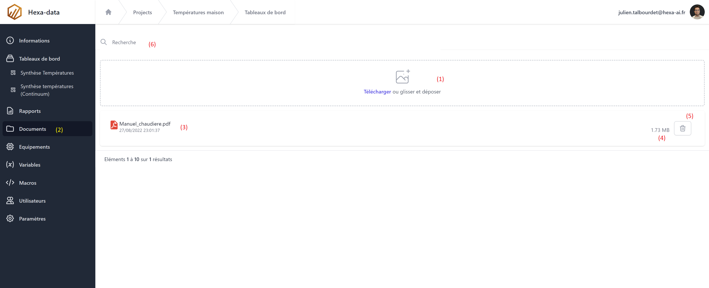

# Documents

L'application Hexa-data parmet par projet de sotcker des fichiers (pdf, txt, bmp, word, xlsx...).
L'accès à ces fichiers est disponible en téléchargment pour tout les lutilisateurs du projet. L'ajout et la suppression de document est disponible seulement pour les utilisateurs avec le role ```Editeur```.




1. Zone de téléchargment (cliquer ou glisser déposer)
2. Bouton de navigation (accès à la page documents)
3. Liste des fichier disponibles
4. Taille du fichier
5. Boutton de suppression
6. Champ de recherche