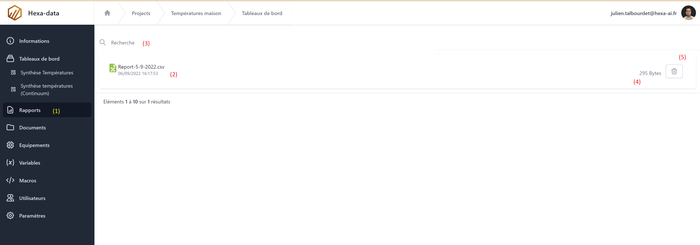

# Rapports

## Introduction

Les rapports sont des fichiers générés par les Macros WarpScript. Ces fichiers sont téléchargeables par l'utilisateur dans le menu ```Rapports```.
Les utilisateurs avec le rôle ```Editeur``` peuvent supprimer ces fichiers depuis la page ```Rapports```.



1. Bouton de navigation (accès à la page rapports)
2. Liste des fichier disponibles
3. Champ de recherche
4. Taille du fichier
5. Bouton de suppression

## API WarpScript

L'api WarpScript permet de manipuler les rapports depuis les macros ou tableaux de bord

[Documentation API](/Fichiers/hdApiReport.md)

