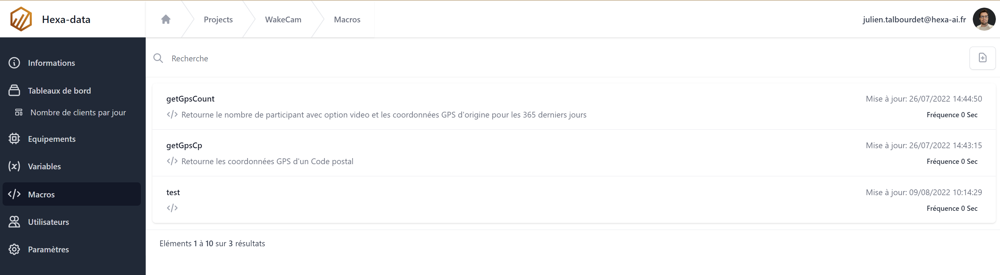

# Création d'une macro

L'ajout et la modification de variable s'effectue depuis la page ```Macros```




## Formulaire de création

La création d'une macro nécessite un nom ainsi que trois descriptions optionnelles (une description pour chacune des langues du projet )

Une fois la macro créée il faut revenir sur sa page pour l'éditer. 


1. Le paramètre 'Fréquence' permet de choisir l'intervalle d'éxécution.


1. Permet de passer du formulaire à l'éditeur de script.
2. Permet de lancer l'éxécution du script.
3. Permet de passer en mode édition.
4. Zone de résultats d'execution et messages d'erreurs.