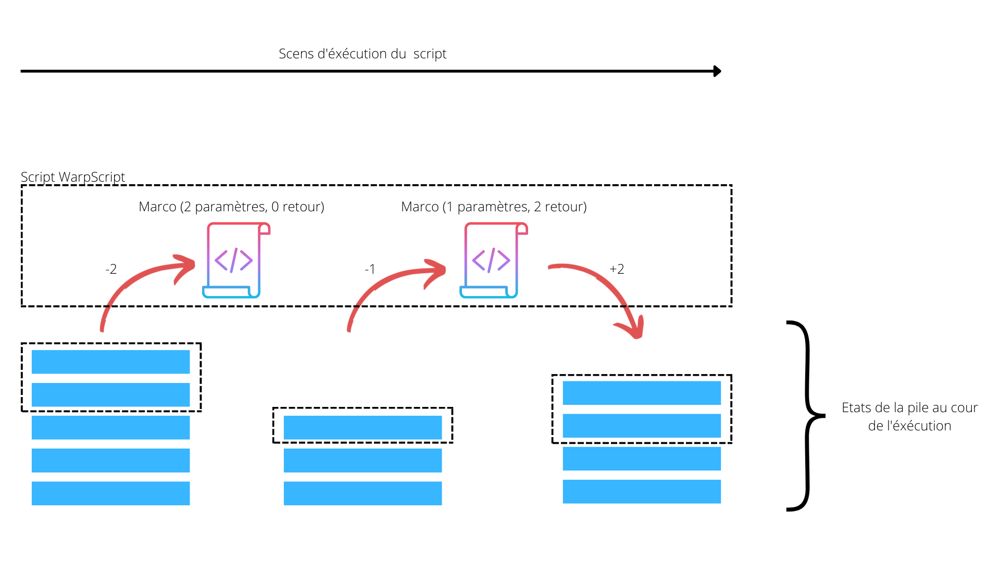

# Macros

Les macros sont des scripts écrits en langage [WarpScript](https://www.warp10.io/content/03_Documentation/04_WarpScript/).
Ces scripts permettent d'interragir avec les données et avec l'exterieur.

Les macros peuvent être utilisés de différentes façon dans Hexa-data:

* Appel cyclique sur interval de temps.
* Appel depuis une tuile d'un tableau de bord.
* Appel depuis une autre macro.

Les macros permettent de requèter la base de données WARP10 et aussi de travailler sur ces données pour les annalyser, les mettre en forme ou les supprimer.

## Le langage WarpScript

Le langauge WarpScript dispose de plus de 1000 fonctions natives et permet entre autre de:

* Récuperer, supprimer ou modifier des enregistrements.
* Réorganiser les enregistrments dans le temps (combler de trous, aligner les timestamp, créer des points intermediaires).
* Faire des appels à une API-REST.
* Effectuer des calculs mathématiques.
* Gerer des boucles, des conditions et des varibles.

?> Cette documentation ne traite pas de l'apprentissage du langage WarpScript, pour en savoir plus n'hésitez pas à vous rendre sur la [documentation en ligne de WarpScript](https://www.warp10.io/content/03_Documentation/04_WarpScript/) (développé par [SenX](https://senx.io) Editeur de Warp10 et WarpScript).

### Particularités du WarpScript

* Langague à pile
* Usage de la notation polonaise inverse



#### Exemple

Dans le WarpScript tout mot clé est une macro et le  passage de paramètre passe par la pile.

Addition de 2 et 3 et stockage dans la variable ```résultat```

```2 3 + 'resultat' STORE ```

#### Dans cette exemple:

* La macro ```+``` prend deux paramètres sur la pile, 2 et 3 et renvoie le resultat sur la pile.
* La macro ```STORE``` prend deux paramètre sur la pile, la valeur à stocker (ici le resultat de l'opération précédente) et le nom de la variable ```'resultat'```


