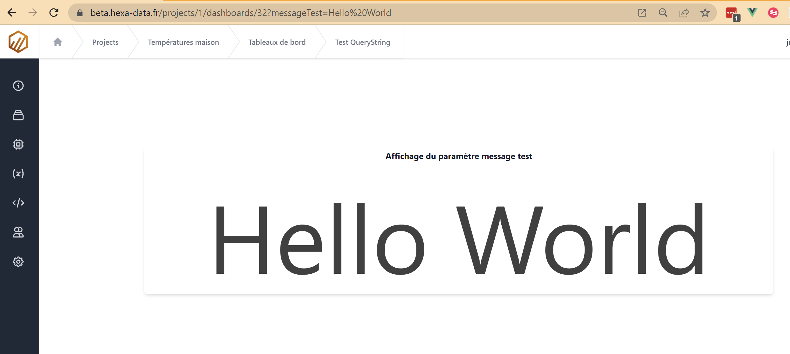

# Les variables du projet

Lors de l'éxécution des script, Hexa-data ajoute quelques variables pour simplifier son utilisation ou étendre les possibilités.

## Les jetons

La lecture et l'écriture dans une base de donnée Warp10 sont conditionnées par l'usage de jetons.

Chaque jeton dispose de droits permettant:

* De cloisonner l'accès aux variables / GTS.
* De définir le type accès (lecture ou écriture)
* De limiter l'accès aux données dans le temps.

Chaque projet Hexa-data dispose d'une paire de jetons (un jeton de lecture et un d'écriture), accessibles dans la page ```Paramètres``` du projet. Les jetons du projet son générés automatiquement par Hexa-data toutes les 24 heures et disposent d'une durée de vie de 24 heures.

Pour simplifier l'usage de ces jetons, leurs valeurs peuvent être remplacées par les variables ```$readToken``` et ```$writeTohen```

### Exemple:

L'exemple ci-dessous démontre l'usage de la fonction FETCH, permettant de requêter des variables / GTS sur les deux derniers jours.

#### Avec le jeton de lecture

```
{ 
  'token' 'rg3ugEWMZLA.EbR4PSUArVCmbp9ATvQsgAK6NQGgFN1oSOGhXq5siiHf6cCFrwyy5J2A3wyEg50XZBW74PcmjNWP6oX_lD8OB0cMn4dy09rSStudjA4x4A7FwoViAb58eDkb76gp3ZEPSrdEF6JSVhiZa7LVoEdnkf9jnSS4QASAYJUMmM2I4qkxnIZmyafs2K9ShTDIv1Hl_EOcNaSFYgorlcoCWd.S' 
  'class' '~.*'
  'labels' {} 
  'start' NOW 2 d -
  'end' NOW
} FETCH
```

#### Avec la variable de projet ```$readToken```

```
{ 
  'token' $readToken 
  'class' '~.*'
  'labels' {} 
  'start' NOW 2 d -
  'end' NOW
} FETCH
```

L'usage de la variable ```$readToken``` améliore la lisibilité et rend le script plus générique.

## La langue de l'utilisateur

La variable ```$language``` contient le nom des descriptions à utiliser pour l'utilisateur qui éxécute la macro.

### Exemple

#### Le script

```
$language
```

### Retourne la chaine:

```
'descriptionL1'
```

Cette variable permet de savoir laquelle des trois langues paramétrées sur le projet correspond à l'utilisateur.
Les tableaux de bord peuvent donc utiliser cette variable pour afficher les bonnes descriptions de variables / GTS sur les graphiques.


## Usage des paramètres QueryString dans les tableaux de bord

Les [queryString](https://en.wikipedia.org/wiki/Query_string) sont des paramètres qui peuvent être passés dans une url. Les scripts utilisés par les tableaux de bord disposent, à l'éxécution, de variables correspondant aux différents paramètres passés dans l'URL de la page.

### Exemple:

La tuile de type ```display``` affiche le contenu de la variable ```$messageTest```

Lorsque le tableau de bord est appellé avec l'URL ```https://beta.hexa-data.fr/projects/1/dashboards/32?messageTest=Hello%20World```, la tuile affiche ```Hello World```.



