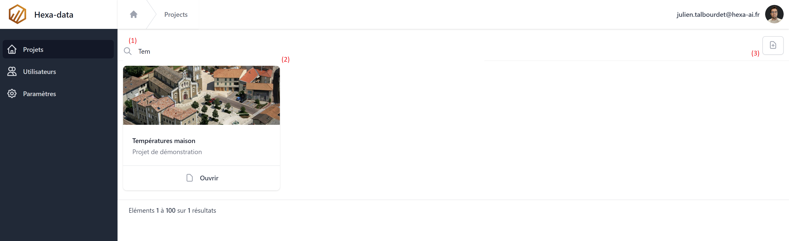
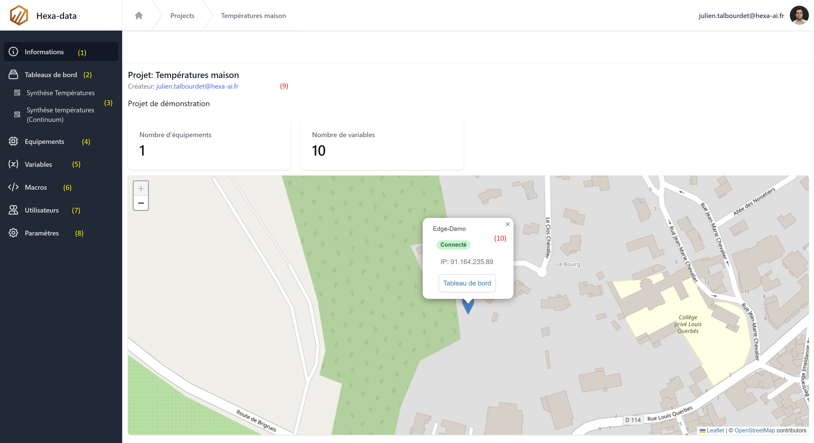

# Projets

Le projet est la base d'une application Hexa-data. Tout équipement, variable ou tableau de bord doit être attaché à un projet.

1. Barre de recherche
2. Etiquette de projet
3. Ajouter un projet

## Le éléments d'un projet

1. Page d'acceuil du projet
2. Page des tableaux de bords
3. Tableaux de bord favoris
4. Page des équipements
5. Page des variables
6. Page des Macros
7. Page de gestion des utilisateurs
8. Paramètres du projet
9. informations, page d'acceuil du projets
10. Carte des équipments (dont les coordonnées GPS on étés saisies)