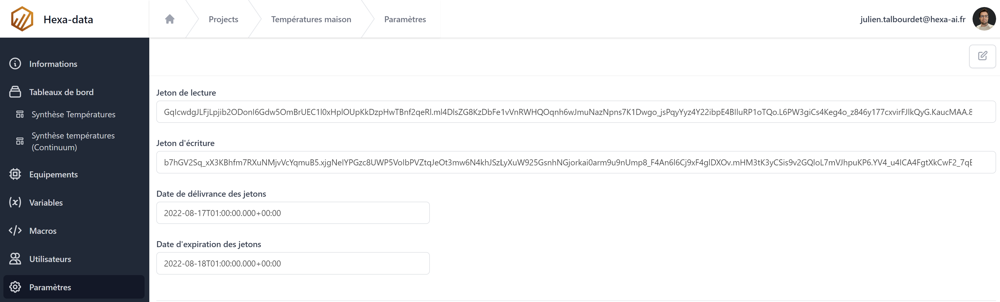
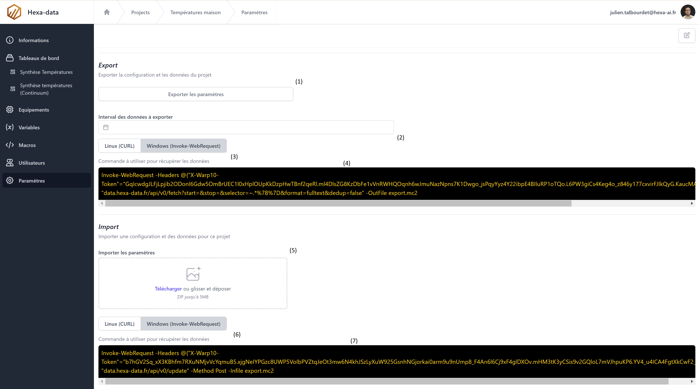

# Paramètres d'un projet

La page paramètre d'un projet permet:

* D'éditer la définition d'un projet
* De récupèrer les jetons de lecture et d'écriture
* De sauvegarder et restaurer le projet
* De sauvergarder et restaurer les données du projet


## Les champs d'un projet

| Champ           | Requis | Description                                                                                          |
|-----------------|--------|------------------------------------------------------------------------------------------------------|
| Nom             | Oui    | Nom du nouveau projet                                                                                |
| Description     | Oui    | Description du nouveau projet                                                                        |
| Image           | Non    | Image permettant d'identifier rapidement le projet dans la liste des projets                         |
| Adresse         | Non    | Adresse postale du projet (Non utilisé actuellement)                                                 |
| Latitude        | Non    | Latitude du projet (Non utilisé actuellement)                                                        |
| Longitude       | Non    | Longitude du projet (Non utilisé actuellement)                                                       |
| Langue numéro 1 | Oui    | Première langue pour la traduction des descriptions de variables et textes sur les tableaux de bord  |
| Langue numéro 2 | Oui    | Seconde langue pour la traduction des descriptions de variables et textes sur les tableaux de bord   |
| Langue numéro 3 | Oui    | Troisième langue pour la traduction des descriptions de variables et textes sur les tableaux de bord |

## Les jetons



La page ```jetons``` permet de récupèrer les jetons de lecture et d'écriture du projet. Ces jetons permettent l'exploitation de la base de données Warp10 depuis l'exterieur d'Hexa-data.

## Sauvegarde et restauration d'un projet et de ces données



1. Export du projet (Equipements, Variables, Macros, Tableaux de bord)
2. Choix de la plage de temps sur laquelle exporter les données
3. Choix du format de commande d'export des données aux formats CURL et Invoke-WebRequest (Windows Power shell version >= 7.0.0)
4. Commande d'export des données
5. Import du projet (Equipements, Variables, Macros, Tableaux de bord)
6. Choix du format de commande d'import des données aux formats CURL et Invoke-WebRequest (Windows Power shell version >= 7.0.0)
7. Commande d'export des données (La commande doit être executée dans le repertoire ou se trouve le fichier export.mc2)
