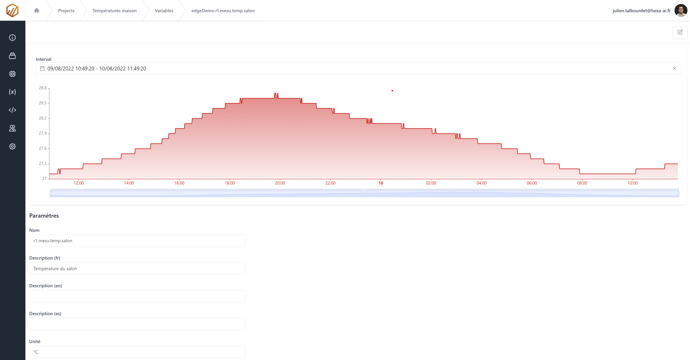

# Visualiser les valeurs d'une variable

Cliquer sur une variable dans la page des variables pour aller sur sa vue.
Dans cette page il est possible de visualiser éditer ou supprimer une variable.

## Visualier les valeurs

Par défaut, la courbe affiche l'historique des trois dernières heures. Le sélecteur permet de choisir prciésement l'historique à afficher.
Si la plage demandée dépasse 10 000 points, les données sont sous-échantillonées selon l'algorithme [LTTB](https://skemman.is/bitstream/1946/15343/3/SS_MSthesis.pdf) (Largest Triangle Three Buckets).

Si l'utilisateur sélectionne une date/heure de fin supérieure à celle actuelle, la courbe se rafraichit automatiquement afin d'observer en direct les évolutions.

## Modifier la déclaration

La modification ainsi que la suppression de la variable s'effectue avec les boutons en haut à droite dans la barre d'outils.

### Champs modifiables

| Champ         | Description                                                                                   |
|---------------|-----------------------------------------------------------------------------------------------|
| descriptionL1 | Valeur du champ description dans le formulaire d'édition de variable (Langue n° 1 du projet) |
| descriptionL2 | Valeur du champ description dans le formulaire d'édition de variable (Langue n° 2 du projet) |
| descriptionL3 | Valeur du champ description dans le formulaire d'édition de variable (Langue n° 3 du projet) |
| unit          | Valeur du champ unité dans le formulaire d'édition de variable                               |

## suppression

Lors de la suppresion de la variable tous les enregistrements sont également supprimés.